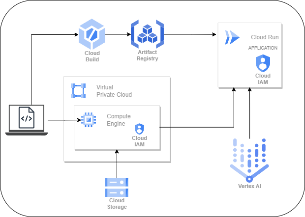
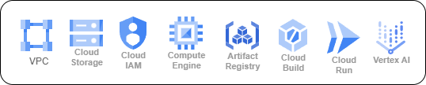

# Infrastructure Automation on GCP

---
## Objective
* To automate the creation and provision of GCP Services using shell scripting, gcloud CLI and other IaC Tools

---
## Architecture Design


---
## GCP Services


* Custom VPC with three subnets -> App Network
* Static IP Address -> Database Static Ip Address
* Cloud Storage -> Store Startup Script 
* IAM Service Account  -> For Security
* IAM Custom Role -> For Security 
* Compute Engine -> Database Server
* Artifact Registry -> Store Container Image
* Cloud Build -> Build the image and submit to Artifact Registry
* Cloud Run -> Run the App
* Vertex AI Language Model -> Chat Language Model

---
### Using gcloud and shell scripting

#### Prerequisite
* GCP Account
* Project Owner IAM Role

```sh
# Automate the GCP Services Creation
source environment-variables.sh
sh infrastructure-automation-gcp.sh

# Clean Up
source environment-variables.sh
sh cleanup.sh
```

---
### Using terraform

#### Prerequisite
* GCP Account
* Project Owner IAM Role
* Terraform CLI

```sh
# Using Terraform (Local State)
# Automate the GCP Services Creation using Terraform
source tf-files/tf-environment-variables.sh
sh tf-files/tf-infra.sh

# Clean Up
source tf-files/tf-environment-variables.sh
sh tf-files/tf-cleanup.sh

---
# Using Terraform (Cloud Storage State)
# Automate the GCP Services Creation using Terraform
source tf-files-with-state/tf-state-environment-variables.sh
sh tf-files-with-state/tf-state-infra.sh

# Clean Up
source tf-files-with-state/tf-state-environment-variables.sh
sh tf-files-with-state/tf-state-cleanup.sh
```


---
Resources:
* Repository: https://github.com/mregojos/infrastructure-automation-gcp
* Web App Repository: https://github.com/mregojos/model-deployment
* CI/CD on GCP GitHub Repository: https://github.com/mregojos/CI-CD-GCP
* Tech Stack GitHub Repository: https://github.com/mregojos/tech-stack
* Google Cloud Docs: https://cloud.google.com/docs
